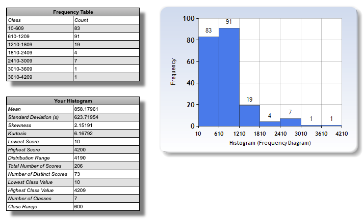

# Lazy nepremicnine stats

## Overview

I used this website to generate below chart: https://www.socscistatistics.com/descriptive/histograms

## Notes

The scraping logic can be found in `scraper.js` file. The logic is really naive and even doesn't automatically paginate thought all the pages. You need to do that manually.
