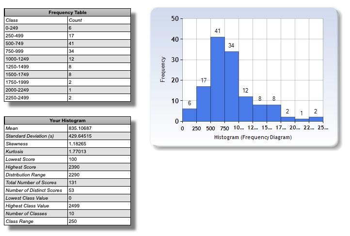
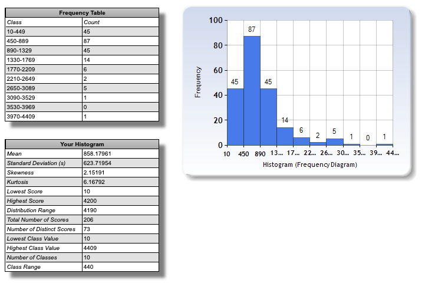

# Lazy nepremicnine stats

## Overview

Data was scraped from: https://www.nepremicnine.net/oglasi-oddaja/ljubljana-mesto/stanovanje/?s=16 (the most recent apartment rent offers in Ljubljana city).

I used this website to generate below chart: https://www.socscistatistics.com/descriptive/histograms

## Notes

The scraping logic can be found in `scraper.js` file. The logic is really naive and even doesn't automatically paginate thought all the pages. You need to do that manually.

**This data is not 100% accurate or unbiased!**

## Market snapshots

### 11.10.2022

### 27.09.2022

